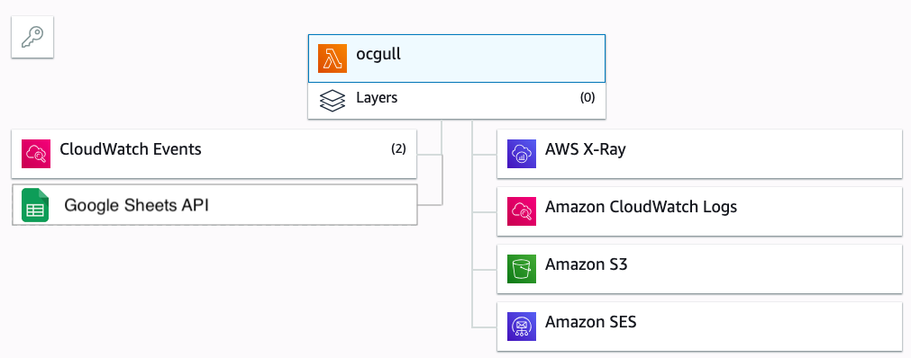

Ocgull: Gulls that patrol the dock for available Ocs
===

Quickstart:
---
### Clone repo
```
$ mkdir -p ~/workspace/ && cd ~/workspace
$ git clone https://github.com/tvhong/ocgull.git
```

### Setup virtual environment

The below are my usual setup, which uses `pyenv` and `pyenv-virtualenv` wrapper.
Feel free to use your favorite tool for creating virtual env.

```bash
# Install pyenv and pyenv-virtualenv with Homebrew.
$ brew install pyenv pyenv-virtualenv

# Create virtualenv `ocgull` based off Python v3.7.1
$ pyenv install 3.7.1 # Install Python 3.7.1 to pyenv
$ pyenv virtualenv 3.7.1 ocgull

# Activate the virtual environment
$ pyenv activate ocgull
$ pyenv which python # Should print .pyenv/versions/ocgull/bin/python
$ python --version # Make sure it's 3.7.1

# Install dependencies
$ cd ~/workspace/ocgull/ && pip install -r requirements.txt
```

Tip: You probably want to always activate `ocgull` virtualenv when accessing
the project directory. For `pyenv`, this can be achieved with:
```bash
$ cd ~/workspace/ocgull && pyenv local ocgull
```

### Obtain a Google Cloud Platform API key
See https://developers.google.com/sheets/api/guides/authorizing#APIKey

### Run the program on local
Assuming you're in project repo and activated virtual env, this should fetch
the data from a test spreadsheet and print out the result in stdout.
```bash
$ GCP_API_KEY=<api-key-obtained-above> ./src/infra/run.py
```

Run `./src/infra/run.py -h` for more options.

Note: email sending relies on Amazon SES (Simple Email Service). So, to send
emails, it is required that awscli is installed and credentials are setup.
See https://docs.aws.amazon.com/cli/latest/userguide/cli-configure-files.html

Infrastructure
---


This program runs on AWS lambda, which is periodically triggered by CloudWatch Events.

Inputs:
- Google Sheet API - fetch the latest spreadsheet.
- Amazon S3 - fetch the previous spreadsheet snapshot.

Outputs:
- Amazon S3 - store the latest spreadsheet snapshot.
- Amazon SES - service for sending emails.
- Amazon CloudWatch Logs - logging service for debugging.

Deployment
---
From project root, run:
```bash
./src/infra/deploy.py [-pip] # by default we don't reinstall pip
```

Test
---
From project root, run:
```bash
./src/infra/test.py [path.to.specific.test]
```
